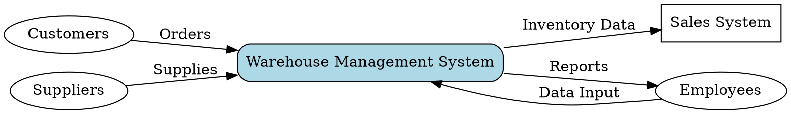
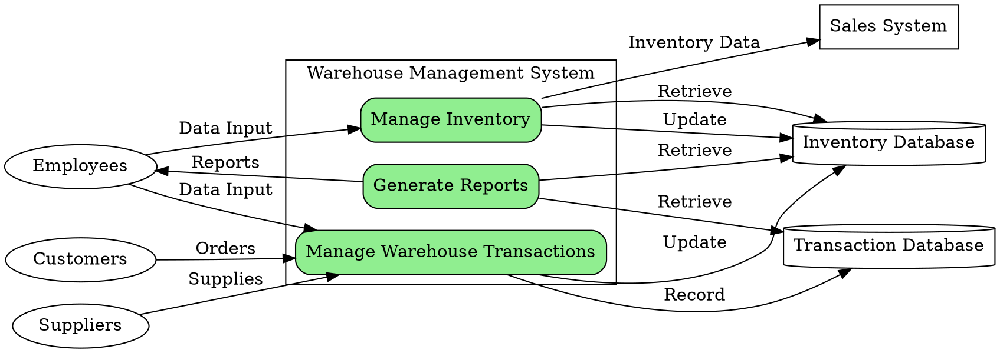

```markdown
# Data_Flow_Diagram.md

## Data Flow Diagrams for Warehouse Management System

This document describes the data flow within the Warehouse Management System using DOT language.  Due to the lack of a complete SRS, this DFD is based on the provided BRD and FDS, focusing on core functionalities.  A more comprehensive DFD would require a detailed SRS.


### Context Diagram

This diagram shows the high-level interaction between the system and external entities.



**Entities:**

* **Customers:**  Place orders which trigger the system to manage inventory.
* **Suppliers:** Provide supplies to the warehouse.
* **Sales System:** Receives inventory data from the Warehouse Management System.
* **Employees:** Input data into and receive reports from the system.

**Process:**

* **Warehouse Management System:** The core system managing inventory and transactions.


### Level 0 DFD

This diagram breaks down the Warehouse Management System into its major processes.



**Processes:**

* **Manage Inventory:**  Handles adding, updating, deleting, and querying inventory items.
* **Manage Warehouse Transactions:** Records and processes inbound and outbound transactions, updating inventory levels.
* **Generate Reports:** Creates reports based on inventory and transaction data.

**Data Stores:**

* **Inventory Database:** Stores information about inventory items (name, code, quantity, price, supplier).
* **Transaction Database:** Stores information about inbound and outbound transactions (item, quantity, date, employee).

**Entities (as in Context Diagram):**

* **Customers**
* **Suppliers**
* **Sales System**
* **Employees**


This DFD provides a simplified view.  Further refinement would require a fully detailed SRS to include more specific processes and data flows.  For example,  the "Manage Inventory" process could be further broken down into sub-processes for adding, updating, deleting, and searching inventory. Similarly, "Manage Warehouse Transactions" can be broken into inbound and outbound transaction management.  The addition of error handling and security components would also enhance the model's completeness.
```