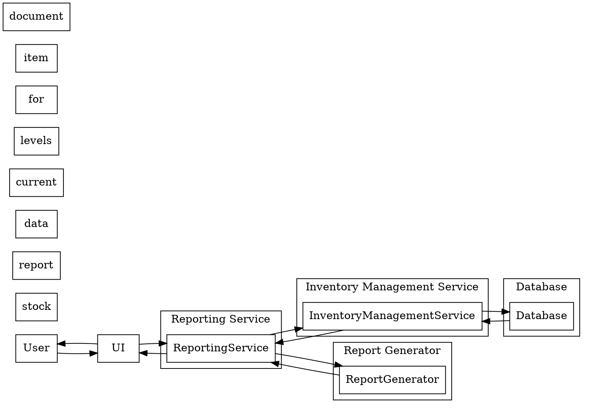

```markdown
# Sequence_Diagrams.md

This document contains sequence diagrams for key user flows in the Warehouse Management System, using the DOT language.

## Diagram 1: Adding a New Item

This diagram illustrates the sequence of interactions when a user adds a new item to the inventory.

```dot
digraph add_item {
  rankdir=LR;
  node [shape=box];
  User -> UI: Input item details (name, code, quantity, price, supplier)
  UI -> InventoryManagementService: Request to add new item
  InventoryManagementService -> Database: Insert new item record
  Database -> InventoryManagementService: Confirmation (success/failure)
  InventoryManagementService -> UI: Response (success/failure message)
  UI -> User: Display response message
  subgraph cluster_0 {
    label = "Inventory Management Service";
    InventoryManagementService;
  }
  subgraph cluster_1 {
    label = "Database";
    Database;
  }
}
```

**Explanation:**

1.  **User:** The user interacts with the UI (User Interface) to input the details of a new item.
2.  **UI:** The UI sends a request to the `InventoryManagementService` to add the new item.
3.  **InventoryManagementService:** This service validates the input data and then sends a request to the database to insert the new item record.
4.  **Database:** The database inserts the new item record and sends a confirmation (success or failure) to the `InventoryManagementService`.
5.  **InventoryManagementService:** The service sends a response (success or failure message) back to the UI.
6.  **UI:** The UI displays the response message to the user.


## Diagram 2: Processing an Incoming Shipment (Stock Input)

This diagram shows the interactions involved when processing a new shipment of goods into the warehouse.

```dot
digraph stock_input {
  rankdir=LR;
  node [shape=box];
  User -> UI: Input shipment details (item, quantity, supplier)
  UI -> WarehouseManagementService: Request to add stock
  WarehouseManagementService -> InventoryManagementService: Request to check item & update quantity
  InventoryManagementService -> Database: Update item quantity
  Database -> InventoryManagementService: Confirmation (success/failure)
  InventoryManagementService -> WarehouseManagementService: Response (success/failure & updated quantity)
  WarehouseManagementService -> Database: Log stock input event
  Database -> WarehouseManagementService: Confirmation
  WarehouseManagementService -> UI: Response (success/failure message)
  UI -> User: Display response message
  subgraph cluster_0 {
    label = "Warehouse Management Service";
    WarehouseManagementService;
  }
  subgraph cluster_1 {
    label = "Inventory Management Service";
    InventoryManagementService;
  }
  subgraph cluster_2 {
    label = "Database";
    Database;
  }
}
```

**Explanation:**

1.  **User:** The user inputs shipment details (item, quantity, supplier) via the UI.
2.  **UI:** The UI sends a request to the `WarehouseManagementService` to add the stock.
3.  **WarehouseManagementService:** This service calls the `InventoryManagementService` to check if the item exists and update the quantity.
4.  **InventoryManagementService:** This service updates the item quantity in the database.
5.  **Database:** The database confirms the update (success/failure).
6.  **InventoryManagementService:** This service returns a response (success/failure and updated quantity) to the `WarehouseManagementService`.
7.  **WarehouseManagementService:** The service logs the stock input event in the database.
8.  **Database:** The database confirms the log entry.
9.  **WarehouseManagementService:** This service returns a response (success/failure message) to the UI.
10. **UI:** The UI displays the response message to the user.


## Diagram 3: Generating a Stock Report

This diagram depicts the process of generating a report on current stock levels.



**Explanation:**

1.  **User:** The user requests a stock report through the UI.
2.  **UI:** The UI sends a request to the `ReportingService`.
3.  **ReportingService:** The service requests the current stock levels from the `InventoryManagementService`.
4.  **InventoryManagementService:** The service queries the database for item data.
5.  **Database:** The database returns the item data.
6.  **InventoryManagementService:** The service sends the item data to the `ReportingService`.
7.  **ReportingService:**  The service sends the data to the `ReportGenerator` to create the report document.
8.  **ReportGenerator:** The component generates the report document and sends it back to the `ReportingService`.
9.  **ReportingService:** The service sends the report document to the UI.
10. **UI:** The UI displays the report to the user.


These diagrams provide a high-level overview of the system's functionality.  Further detail will be added as the project progresses.
```